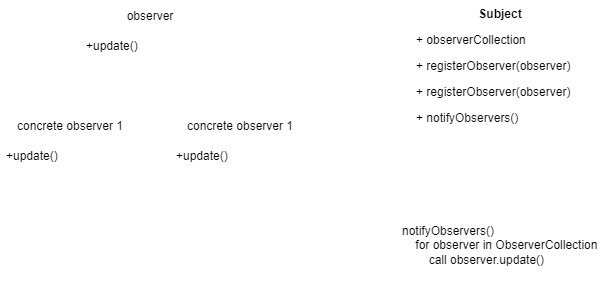

The observer pattern allows one object to notify dependent objects of a change its state and updates them automatically. This pattern is commonly seen in frontend frameworks to allow the UI to update by defining variables that are subscribed to an observer such that the front end automatically updates as the data is changed, without the need for the frontend to keep querying the state.

The observer patten can also be thought of as a publish / subscribe pattern in we have a single publisher and multiple subscribers.

## Uses

The observer pattern is used when to keep other objects notified of a change in state of another object without having to requery the original object.

We see uses of the observer pattern where ever there is a need for loose coupling between objects examples include:

- Pub / Sub queues
- Event handlers responding to events e.g. user clicking a button on the screen
- Social media updates e.g. your friend posts something - you get notified without having to go check your friends page

## Example Implementation

