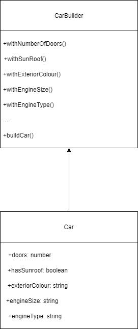

The buider pattern allows us to construct new instances of objects specifying only the type and content. The builder pattern is used to simplify the creation of complex objects, by removing the need to use "new" followed by the constructor with a list of properties.

The builder pattern becomes useful when constructing complex objects with many properties some of which maybe optional, this results in lengthy constructors and increases the cognitive load on the developer.

Let's consider the case where we need to construct a car, depending on the type of car we want to create, we would have options for the number of doors, size of engine, type of engine, exterior colour, interior colour, seat coverings and so the list goes on. 

The builder allows us to simplify the construction of the car object by handing over the responsibility for creating the car object to a builder. The builder knows all of the properties needed to construct a car and can assign default values where we have optional parameters e.g. not all cars have sun roofs.



### Example:
```
type CarColours = 'pearlescent red' | 'metallic blue' | 'silver' | 'copper';
type EngineSize = '1.2l' | '1.4l' | '2.0l';
type EngineType = 'diesel' | 'turbo diesel' | 'electric' | 'petrol' | 'turbo' | 'hybrid';
type NumberOfDoors =  2 | 3 | 4 | 5;
type Manufacturer = 'Renault' | 'Citroen' | 'Peugeot';

interface Car {
  numberOfDoors: NumberOfDoors;
  exteriorColour: CarColours;
  hasSunRoof: boolean;
  engineSize: EngineSize;
  engineType: EngineType;
  make: Manufacturer;
}

class CarBuilder {

  private readonly _car: Car;
  
  constructor() {
    this._car = {
      engineSize: '1.2l',
      engineType: 'diesel',
      hasSunRoof: false,
      numberOfDoors: 5,
      exteriorColour: 'silver',
      make: 'Renault',
    };
  }

  withEngineSizeOf(engineSize: EngineSize) {
    this._car.engineSize = engineSize;
    return this;
  }

  withEngineTypeOf(engineType: EngineType) {
    this._car.engineType = engineType;
    return this;
  }

  withASunRoof(hasSunRoof: boolean) {
    this._car.hasSunRoof = hasSunRoof;
    return this;
  }

  withExteriorColourOf(exteriorColour: CarColours) {
    this._car.exteriorColour = exteriorColour;
    return this;
  }

  withNumberOfDoors(numberOfDoors: NumberOfDoors) {
    this._car.numberOfDoors = numberOfDoors;
    return this;
  }

  manufacturedBy(make: Manufacturer) {
    this._car.make = make;
    return this;
  }

  buildCar(): Car {
    return this._car;
  }
}

function printCar(car: Car) {
  const carInfo = `The car has ${car.exteriorColour} paint \r
   an engine size of ${car.engineSize} \r
   an engine type of ${car.engineType} \r
   it has ${car.numberOfDoors} doors \r
   it ${car.hasSunRoof ? ' has a sunroof' : ' does not have a sunroof'} \r
   and it is made by ${car.make}\n`;
   console.log(carInfo);
}

function buildSomeCars() {
  const aNewCitroen: Car = new CarBuilder()
    .manufacturedBy('Citroen')
    .withEngineSizeOf('1.4l')
    .withExteriorColourOf('pearlescent red')
    .buildCar();
  
  printCar(aNewCitroen);
  
  const aNewPeugeot: Car = new CarBuilder()
    .manufacturedBy('Peugeot')
    .withASunRoof(true)
    .withEngineTypeOf('petrol')
    .withExteriorColourOf('metallic blue')
    .buildCar();
  
  printCar(aNewPeugeot);
};

```

Whilst this is a fairly trivial example, the advantages the builder gives us are:

* We don't need to remember the order in which to provide the parameters to the constructor
* It makes the intent of the code clearer being more readable
* We only need to provide parameters for the non default values
* When we press the "." we are prompted with all of the methods making it easier to pick our options
* Avoids needing to pass null for optional parameters

#### disadvantages
* more code is required approximately double over the standard class
* A builder should only be used after refactoring the class into smaller sub classes has been considered i.e. a longer parameter list is usually not a good thing